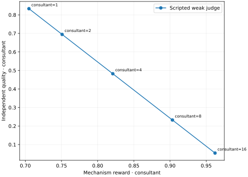

# OversightArena

A Python research library for testing whether scalable oversight **rewards the behavior we want as agents are optimized**.

An oversight mechanism is an arbitrary workflow plus a reward rule for every trainable participant. Judges, monitors, consultants, debaters and swarm members can all be trainable. A role without a training reward must be declared a fixed fixture. Ground-truth evaluation lives on a separate path and can be unavailable or delayed.

```bash
python -m pip install -e '.[dev,plots]'
oversight-arena demo --output runs/demo --plots
# Open runs/demo/report.html, unresolved.html and optimization.svg
```

The offline demo runs SQL result checking, paired interventions, best-of-N, prompt search, categorical policy-gradient training, a reporting-incentive game and delayed forecast resolution. Its agents are scripted: the plot demonstrates a deliberately misspecified judge, not a finding about real models.



## What is included

| Area | Implementation |
|---|---|
| Arbitrary mechanisms | Async `Workflow` and `Context`; multi-party messages, private recipients, optional reasoning/interpretability channels, permissioned tools, bounded agent tool loops |
| Protocol templates | Debate (sequential/simultaneous), interactive consultancy, monitoring with optional deferral, swarms with audited reporting bonuses and false-report penalties |
| Sampling | Arbitrary policy substitutions, oracle-assisted paired prompt interventions, seeded policy mixtures and conditional game-tree sampling |
| Optimization | Exact empirical best-of-N with ties/nonuniform base probabilities, nested general-sum best-of-N, multi-agent prompt search with simultaneous/alternating updates and held-out evaluation |
| Training | Working categorical REINFORCE over policy populations, checkpoint/restore, experience export and an external trainer interface |
| Analysis | Paired ASD with task-cluster bootstrap intervals, ordering agreement, observed-support selection regret, local reward/quality covariance, calibration, pure equilibria, mixed-profile unilateral regret, coalition deviations and response dynamics |
| Domains | Exact match, executable private-database SQL scoring, proper forecast scoring, dataset manifests and arbitrary artifact-evaluator adapters |
| Verification | Artifact/specification-bound claims and versioned verification receipts, access/cost controls and selective visibility |
| Results | Content-addressed episodes, transactional SQLite storage, append-only evaluation revisions, JSONL round trips, public result projections, HTML reports and optional SVG/PDF plots |
| Integration | Inspect model policies and LLM prompt proposers; explicit ControlArena/Inspect score import and mechanism reward scorers |

The core has no third-party dependencies and requires Python 3.11+. Optional extras are `inspect`, `controlarena`, `plots`, and `dev`.

## A mechanism in a few lines

```python
import asyncio
from oversight_arena import Outcome, PublicTask, Reward, Role, Task, Workflow, run_episode
from oversight_arena.domains import ExactMatch
from oversight_arena.policies import ConstantPolicy

async def mechanism(ctx):
    proposal = await ctx.ask("worker", "Answer the question.")
    verdict = await ctx.ask("judge", 'Return {"reward": number}.')
    return Outcome({"worker": Reward(verdict.content["reward"])}, proposal.content)

record = asyncio.run(run_episode(
    Task(PublicTask("example", "What is 2 + 2?"), evaluator_data={"answer": 4}),
    Workflow("direct_judgement", mechanism, config={"reward_rule": "judge scalar"}),
    [Role("worker"), Role("judge", trainable=False)],
    {"worker": ConstantPolicy({"answer": 4}), "judge": ConstantPolicy({"reward": 0.8})},
    scorer=ExactMatch(("worker",)),
))
assert record.rewards["worker"].value == 0.8
assert record.evaluations[0].per_agent["worker"]["quality"] == 1.0
```

Replace `ConstantPolicy` with any async policy, or `InspectPolicy("provider/model")` after installing the `inspect` extra and configuring that provider. Mechanisms receive a `PublicTask`; only post-run scorers receive `Task.evaluator_data`. Information deliberately assigned to a participant belongs in `Task.role_data`.

## ControlArena

OversightArena is a standalone core with an optional bridge. ControlArena's settings and micro-protocols remain useful; its suspicion and task scores are not automatically per-agent training utilities. Define that utility explicitly, attach it as an Inspect scorer, then map reward and evaluation scores separately. [ControlArena's scorer documentation](https://control-arena.aisi.org.uk/scorers.html) describes its existing scoring layer.

```bash
python -m pip install -e '.[controlarena]'
python examples/controlarena_bridge.py
```

This runs a genuine ControlArena task locally without API keys or Docker, writes its Inspect log, and imports a validated OversightArena episode. The same adapter accepts real setting logs. See [integration details](docs/integrations.md).

## Research guide

- [Architecture and extension contracts](docs/architecture.md)
- [Experiment recipes and statistical interpretation](docs/experiments.md)
- [Mechanism design, training robustness and swarm equilibria](docs/mechanism-design.md)
- [Domains, capability gaps and verified claims](docs/domains.md)
- [Integrations and reproducibility](docs/integrations.md)
- [Worked examples](examples/README.md)

ASD follows the distinction between agent incentives and final judge accuracy in [A Benchmark for Scalable Oversight Protocols](https://arxiv.org/abs/2504.03731). Nested optimization is motivated by [Debate with Self-Play Best-of-N Optimization](https://www.lesswrong.com/posts/hb8pv3zyAHGJpwz9F/debate-with-self-play-best-of-n-optimization). The implementation supports general-sum utilities and explicitly handles tied rewards.

## Scope and limits

This is an extensible experimental package, not a claim that any mechanism is training-robust. Finite-support regret is not global incentive compatibility. Best-of-N is not weight training. Prompt labels do not establish honesty. The included REINFORCE implementation trains policy-mixture logits; production LLM weight training requires an external backend. Hidden code tests, Lean kernels, chess engines and interpretability systems plug into the tool/evaluator contracts and are not bundled execution environments.

The Python API prevents accidental oracle transmission by construction; it is not a process security boundary against malicious Python extensions. Tool adapters own their sandboxing. Model seeds are advisory when a provider does not support deterministic inference. Report cost coverage alongside results: unknown API costs remain unknown, and returned-call cost checks cannot undo spending already incurred.

## Development

```bash
python -m pip install -e '.[dev,plots,controlarena]'
pytest -q
ruff check src tests examples
ruff format --check src tests examples
python -m build
```

CI runs core tests on Python 3.11–3.13 and the optional integrations on Python 3.11. MIT licensed.
