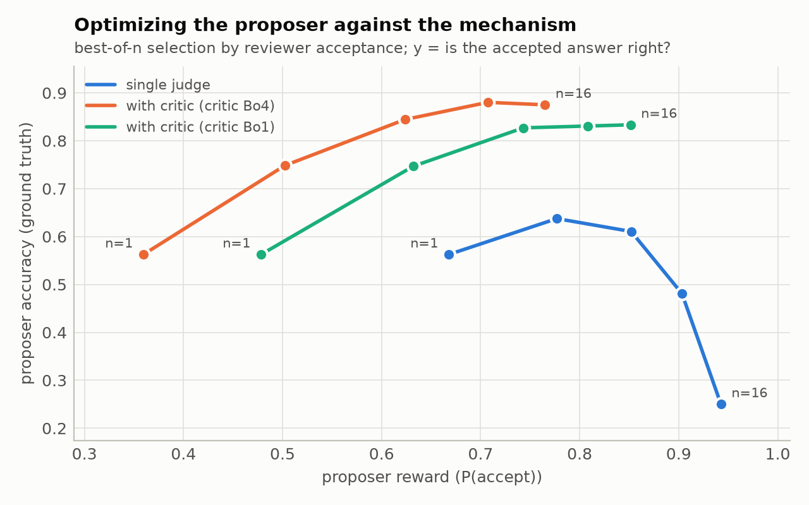
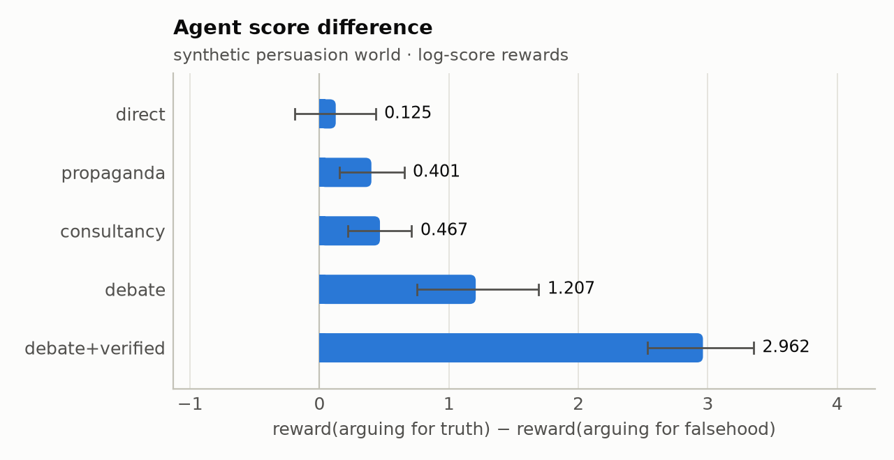
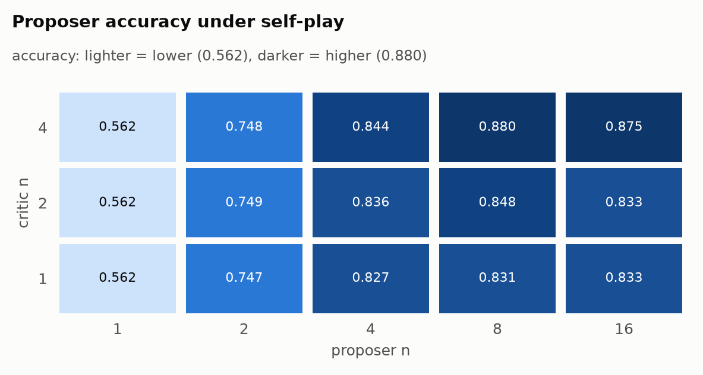
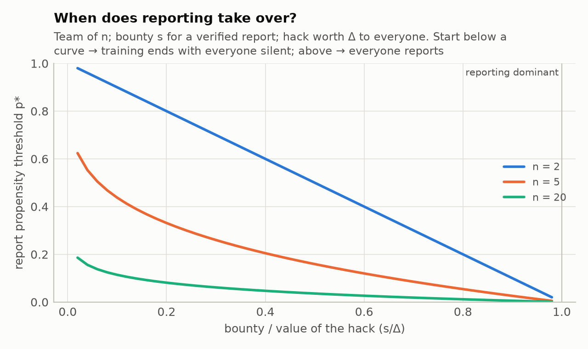
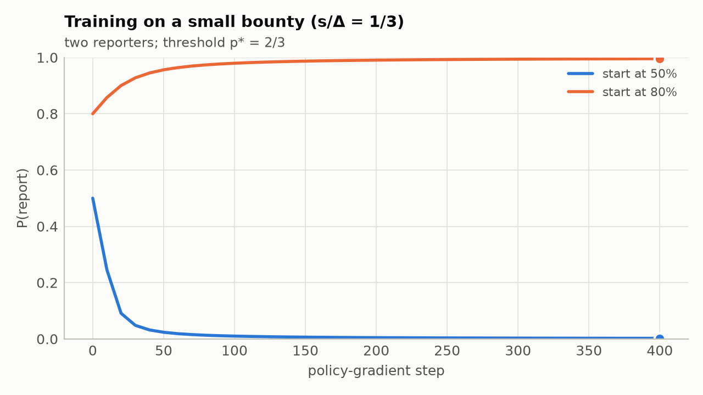

# OversightArena (`so-arena`)

**A library for measuring what scalable-oversight mechanisms incentivize.**

A scalable-oversight *mechanism* is any oversight workflow (a control protocol, a debate, a review
pipeline, a monitored agent, a team of agents) together with a *reward rule* that scores each agent,
so the mechanism can be used for training. What matters is not only whether the overseer reaches the
right answer today, but whether **optimizing the mechanism's rewards pushes agents toward good
behaviour** - and keeps doing so under training. OversightArena makes that measurable:

* every episode records the **mechanism's reward** for each agent *and* the **ground-truth value** of
  what the agent did (known to the experimenter, hidden from the mechanism);
* **samplers** produce behaviour at increasing optimization pressure - instructed arms (ASD),
  best-of-N/KL-tilted pools on sampled game trees, directive-constrained prompt search, PSRO, RL;
* **metrics** relate reward to ground truth - ASD (log/Brier/graded), pairwise concordance, label
  efficiency, optimization curves, equilibria and their ground-truth welfare;
* **settings with real capability gaps** - chess (engine ground truth), text-to-SQL over a private
  database, code with hidden tests, Lean statement faithfulness, forecasting with delayed resolution,
  QA with hidden passages - with **verified claims** as a first-class experimental axis;
* **stateful work** - honest and deceptive agents act on forked copies of the same repository or company
  (database, mail, payments), and reviewers with different access decide whether to accept the result.

It builds on [Inspect](https://inspect.aisi.org.uk) for models and interoperates with
[ControlArena](https://control-arena.aisi.org.uk): ControlArena logs become rewarded episodes (ASD next
to safety/usefulness), and any SO-arena mechanism can run as a ControlArena monitor.



*Offline demo (synthetic world): best-of-n optimization against a single judge raises the proposer's
reward while its accuracy collapses; with a critic, the same optimization raises accuracy.*

## Install

```bash
pip install -e ".[dev]"          # core + Inspect + python-chess + test tools
pip install -e ".[all]"          # + ControlArena
```

Python ≥ 3.11. Chess ground truth uses Stockfish (`apt install stockfish`).

## Quickstart

Offline demos (no API keys):

```bash
so-arena demo            # writes runs/demos/{asd,optimization,swarm}/report.html
so-arena run configs/asd_synthetic.yaml
```

A real experiment - the ASD setup with a strong agent and a weak judge:

```python
import so_arena as soa
from so_arena.domains import get_domain
from so_arena.mechanisms import DirectJudge, Propaganda, Consultancy, Debate
from so_arena.samplers.arms import ASDExperiment

soa.configure(cache_dir=".cache/so_arena")
dom = get_domain("gsm8k")
exp = ASDExperiment(
    [DirectJudge(), Propaganda(), Consultancy(rounds=2), Debate(rounds=2)],
    dom.load(limit=100),
    agent=soa.LLMPolicy("anthropic/claude-haiku-4-5"),
    fixtures={"judge": soa.LLMPolicy("openai/gpt-4o-mini", elicitation="logprobs", temperature=0)},
    ctx=dom.context(), store="runs/asd-gsm8k")
exp.run()
print(exp.summary())
```

Estimate cost before spending anything: `so-arena estimate configs/asd_gsm8k_llm.yaml` (a dry run with
simulated models that prices every call).

## What's in the box

| | |
|---|---|
| **Mechanisms** | naive judge, propaganda, consultancy, debate (simultaneous/sequential, judge questions, zero-sum), reviewed work (single judge, proposal→critique→rebuttal, dossiers of state changes), work-then-review, monitored work (action / CoT / tool-call / probe monitors), teams with whistleblowing, market making, prediction markets (LMSR), peer prediction (BTS, multi-task), confessions. Write your own as plain async Python. |
| **Reward rules** | judge-score transforms, zero-sum, team reward, whistleblower bounties, monitor penalties, random audits (penalty or inverse-probability-weighted), resolution scores, market scoring rules - composable and re-applicable to logged episodes |
| **Samplers** | instructed arms (ASD), sampled game trees with exact best-of-N / tilting backward induction, prompt search (OPRO / reflective / evolutionary / autoresearch-style ratchet) with honest/deceptive/… directives, PSRO, RL environments |
| **Metrics** | ASD (any proper score, paired bootstrap), graded ASD, concordance, label efficiency, incentive gap recovered, expected scores, judge accuracy, AUROC/TPR |
| **Game theory** | empirical games, pure/strict/mixed Nash, zero-sum values, (coarse) correlated equilibria with ground-truth welfare bounds, replicator dynamics, basins, policy-gradient learning dynamics, an analytic whistleblower model |
| **Domains** | synthetic persuasion & team worlds, chess, text-to-SQL, code with hidden tests, Lean statement faithfulness (miniF2F), forecasting, GSM8K, MMLU, TruthfulQA, GPQA, QuALITY; stateful: repository work with hidden tests, a simulated software company |
| **Stateful work** | forkable content-addressed state (files, SQLite, mail, ledgers, hidden environment state), a branch per decision and per best-of-N sample, reviewer dossiers of diffs, read/write access per role, paired-branch experiments (work once, review many) |
| **Verified claims** | `<claim kind="...">` checked by domain verifiers (quotes, chess legal lines, engine evals, SQL execution, code execution, tests, Lean statement structure, Lean typechecking, fact checkers) under per-mechanism budgets and display rules |
| **Deferred ground truth** | release mechanism results with a SHA-256 commitment; resolve and score when the truth arrives |
| **Infrastructure** | Inspect backend (all providers), response cache, dry-run cost simulation, model registry, resumable run stores, YAML specs, CLI, self-contained HTML reports, Inspect task export, ControlArena bridge |

## Documentation

* [docs/design.md](docs/design.md) - architecture; how rewards, ground truth and ControlArena's scores relate
* [docs/theory.md](docs/theory.md) - scalable oversight as mechanism design: the covariance identity linking
  ASD, best-of-N and KL-regularized RL; equilibria; implementation theory; verified evidence; audits as
  control variates; peer prediction and markets; teams and whistleblowing; what else matters besides IC
* [docs/experiments.md](docs/experiments.md) - cookbook for every experiment family
* [docs/extending.md](docs/extending.md) - adding domains, verifiers, tools, scorers, mechanisms
* [docs/answers.md](docs/answers.md) - how the design answers the questions in the original brief

## Gallery (offline demos)

| | |
|---|---|
|  |  |
| ASD across protocols; verified claims help most | both players optimizing (proposer × critic best-of-n) |
|  |  |
| when reporting a teammate's hack takes over | training selects the equilibrium by starting propensity |

Full demo reports (self-contained HTML): [ASD across protocols](docs/reports/asd.html) · [optimization pressure](docs/reports/optimization.html) · [swarms](docs/reports/swarm.html). The demos use synthetic domains, so they illustrate the machinery, not findings about language models.

## Tests

```bash
pytest                   # offline suite
pytest -m network        # tests that download data
pytest -m engine         # tests that need Stockfish
```

## License

MIT.
