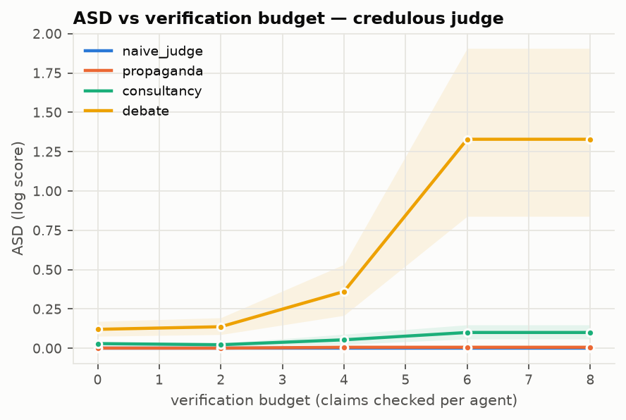
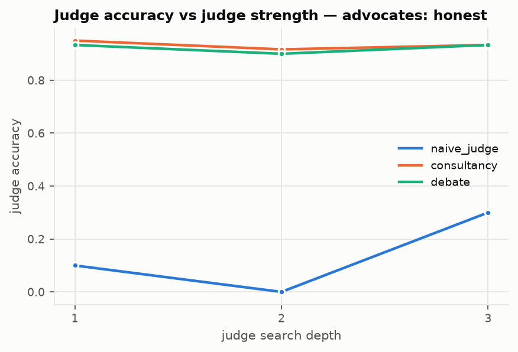
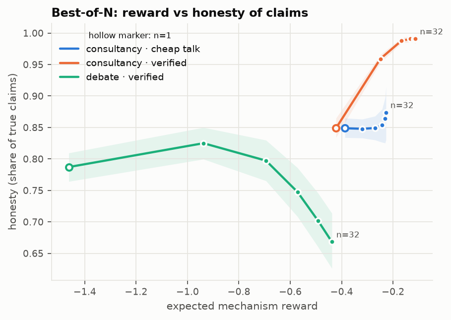
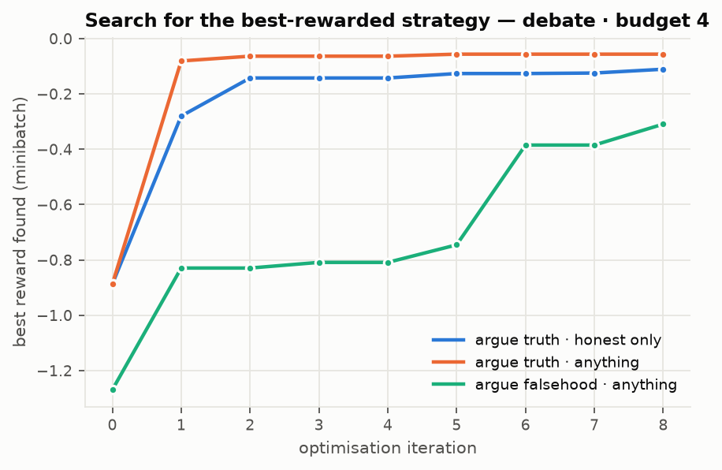
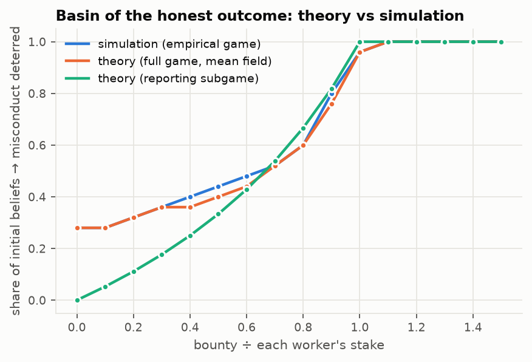
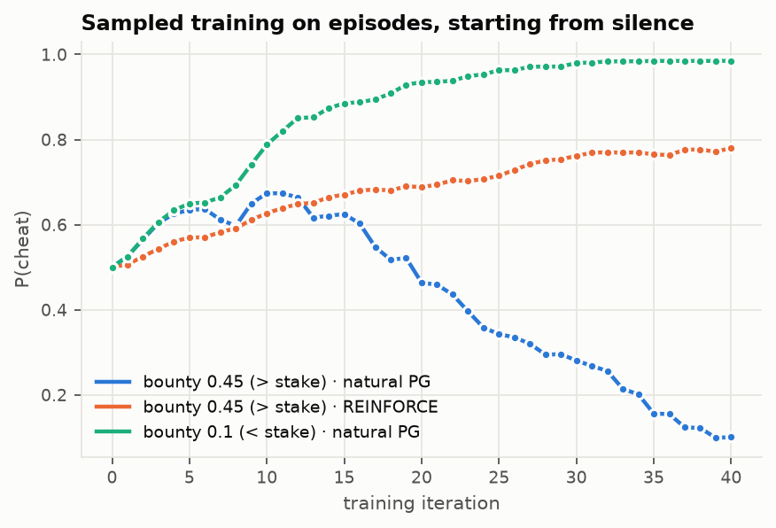
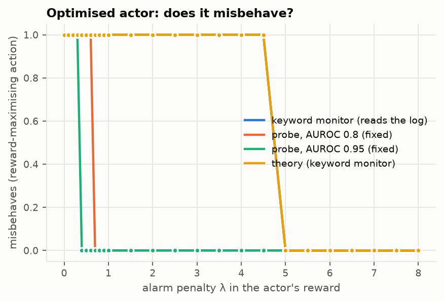
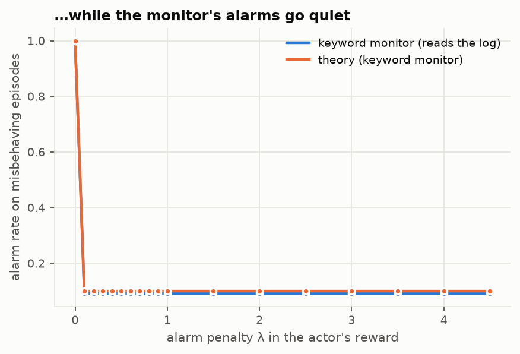
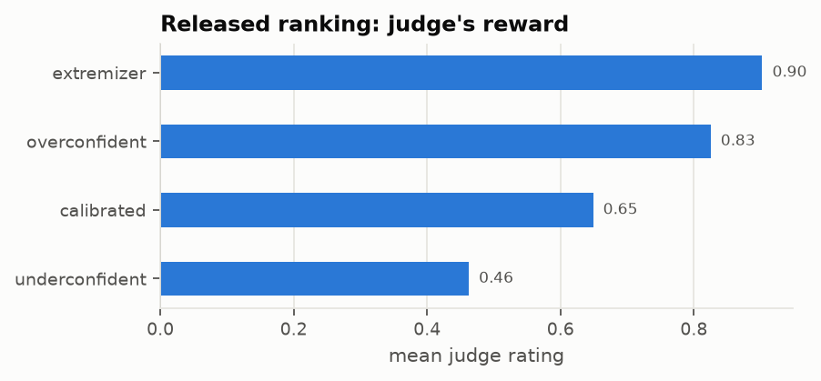
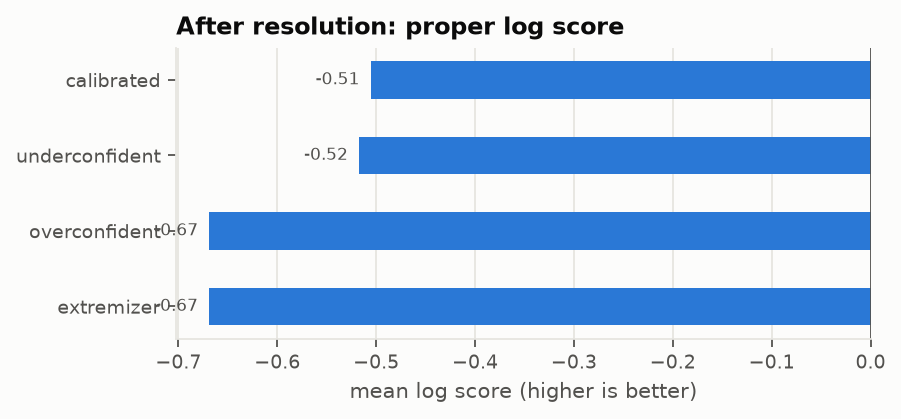

# Demos

Seven built-in experiments run without API keys, using exact programmatic agents (Bayesian judges,
engine-backed chess players, simulated forecasters and workers):

```bash
oversight-arena demo all --out runs/demos          # or one of: hiddenbits chess bon optimize swarm monitoring release
python scripts/build_gallery.py                    # rebuild docs/gallery/ and docs/figures/
```

Each demo writes an HTML report with tables, figures and a transcript browser. The committed
gallery is [docs/gallery/index.html](gallery/index.html). The demos also serve as templates for LLM
experiments: swap the agents for `oa.llm_agents(...)`.

## Verified claims (`hiddenbits`)

**Setup.**
- Experts see 15 hidden bits; the question is whether at least half are 1.
- Advocates reveal bits as claims that trusted code can check, lying when favourable true bits run
  out.
- Judges are exact Bayesian: *rational* (ignore unverified claims) or *credulous* (trust 0.8).

**Finding.**
- Debate's ASD grows steeply with the verification budget: from about 0.12 without verification to
  about 1.3 at 6+ checked claims for the credulous judge.
- Consultancy and propaganda stay near zero.
- With a rational judge, nothing works without verification (cheap talk carries no information),
  and only debate unlocks at larger budgets.

Both effects match the exact disclosure theory (`theory.disclosure`, theory.md Proposition 3).
Competition substitutes for a sceptical judge.



## Chess: a real capability gap (`chess`)

**Setup.**
- Tasks are Lichess puzzle positions where the weak judge's own depth-2 search prefers the wrong
  one of two moves; ground truth is Stockfish at depth 14.
- Engine-backed advocates argue with chess lines that trusted code checks. *Honest* lines show
  best play; *cherry-picked* lines assume poor replies.

**Finding.**
- Alone, the depth-2 judge is wrong on every position (0% accuracy); arguing for the true move is
  *penalised*.
- With honest verified lines, consultancy and debate reach about 90% accuracy.
- With cherry-picked lines they fall to 53–55%.
- In the argument-style game between the debaters, the equilibrium is honest lines for the
  truthful side and cherry-picking for the liar; the judge stays 83% accurate.



## Best-of-N (`bon`)

**Setup.** 32 base-policy samples per task, with random claim counts, lie rates and side errors.
Selection is exact best-of-n by the mechanism's reward (KL axis available in `bon_curve`).

**Finding.**
- For a consultant with verified claims, selection raises the honesty of claims from 0.85 to 0.99.
- In debate, selecting the (assigned) liar's best samples lowers honesty. Selected samples almost
  never lie in verified claims (0.01 per episode, against 0.5 for the rest) but lie beyond the
  verification budget four times as often (2.75 against 0.67), where the credulous judge still
  believes them. Optimisation moves deception to where verification does not reach.



## Strategy search (`optimize`)

**Setup.** Evolutionary search over advocate strategies (claim counts, lie rates, markup) under
three steerings: honest only; anything while arguing the truth; anything while arguing a
falsehood. Every search is re-evaluated on held-out tasks.

**Finding.**
- Debate (budget 4) keeps a frontier gap of 0.26 between the best honest and best deceptive
  strategies.
- Propaganda (budget 2) has essentially none (0.001): a strong optimiser is indifferent between
  truth and lies.



## Swarms (`swarm`)

**Setup.**
- Three workers; one can tamper with the scorer, which adds 0.3 to everyone's reward if undetected
  and costs 0.3 true score.
- The others notice with probability 0.8.
- All strategy combinations are simulated once and re-scored under a shared reward, a bounty
  below the stake (0.1) and a bounty above it (0.45).

**Finding.**
- Under a shared reward every equilibrium has misconduct (true score 0.3).
- A bounty below the stake gives a coordination game: honest and corrupt equilibria coexist, and
  whether snitching pays depends on whether others are expected to snitch.
- Above the stake only the honest equilibrium survives.
- The basin of the honest outcome from the simulated empirical game matches the mean-field theory
  (theory.md Proposition 6).
- Sampled training shows algorithm dependence: from a silent start with a bounty above the stake,
  natural policy gradient deters misconduct while REINFORCE entrenches it.




## Monitoring as a reward (`monitoring`)

**Setup.**
- The actor chooses honest work, overt misbehaviour (always leaves a trace) or covert misbehaviour
  (trace with probability 0.1, slightly lower measured success).
- Its reward is measured success minus λ·alarm.
- Detectors: a monitor that reads the activity log, or simulated probes with a fixed AUROC against
  ground truth.

**Finding** (theory.md Proposition 4).
- Against the log-reading monitor, a tiny penalty (λ = 0.1) turns overt misbehaviour covert. Alarms
  on misbehaving episodes drop from 100% to about 9%, while misbehaviour persists until λ = 5,
  exactly the theoretical threshold.
- A fixed-accuracy probe deters misbehaviour at λ = 0.4–0.7.




## Release now, resolve later (`release`)

**Setup.**
- Simulated forecasters (calibrated, overconfident, underconfident, extremizing) forecast
  questions that have not resolved.
- A weak judge rates the forecasts, an immediate reward.
- The judge's outputs are published as a hash-committed release with a static page and no ground
  truth.

**Finding.** When the questions resolve, the release is verified and scored. The judge had ranked
the extremizer first (0.90) and the calibrated forecaster third (0.65). The proper log score ranks
the calibrated forecaster best (−0.51) and the extremizing and overconfident ones worst (−0.67): the
immediate signal was anti-aligned with the delayed truth.



