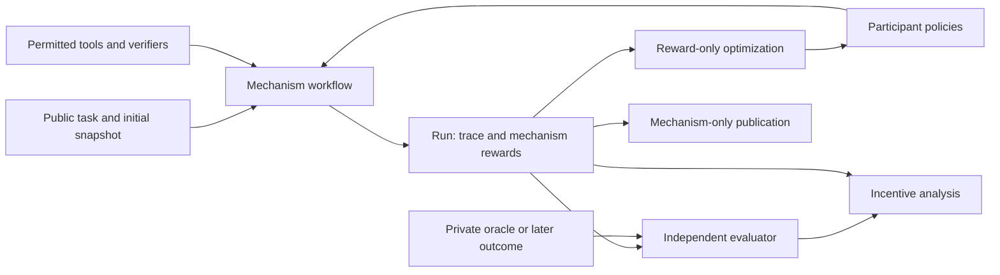

# Design

## Three objects that should not be conflated

1. **Mechanism reward** $r_i$: the signal participant $i$ is trained to maximize, including penalties, verification costs and side payments.
2. **Independent evaluation** $v_i$: the experimenter's measurement of the participant's realized behavior. It may be multidimensional, costly, fallible, or unavailable.
3. **Task outcome** $w$: the quality or safety of the collective result. A mechanism can produce good outcomes while creating bad individual incentives.

`Outcome.rewards` stores the first. `Evaluation.scores[role][dimension]` stores the second and, using a separate dimension, the third. Every `Role(trainable=True)` must receive a finite `Reward`. Missing rewards cause a failed run. A fixture may be scored for diagnostics, but optimization and training exports exclude it.

The evaluator is deliberately not a runner argument. This prevents accidental target sharing through the standard interface; it is **not process isolation against malicious Python plugins**. Experiment authors must keep target data out of `Task.data`, public events, prompt templates, tools and model caches. Dataset targets belong in the scorer or a separate evaluator process. Knowing a target for an assigned-answer intervention is allowed, but only the assigned participant receives it.

## Domain-independent workflows

A `Mechanism` is an async callable from `Context` to `Outcome`. It can branch, recurse, call different participants, inspect actions, verify claims, run auctions, delegate, or decide when to stop. There is no forced debate graph, trusted-judge topology, or zero-sum assumption. `Reward.components` records decomposition; `value` is the explicit scalarization used for optimization. Researchers choose weights and publish them.

Baseline `Debate` uses role-specific endorsement probabilities that need not sum to one. The default is sequential; simultaneous rounds share a pre-round history. `Consultancy` supports follow-up questions. `Monitoring` converts suspicion and task credit into a worker reward and alarm. `Swarm` separates contributions, sealed reporting, and supplied adjudication. False or unverified accusations earn no automatic bonus. These are configurable reference mechanisms, not normative recommendations.

For a trainable judge, supply `additional_rewards(ctx, output)` to a baseline or write a custom workflow. For example, pay a judge a proper score against a randomly sampled, mechanism-accessible audit. That audit is part of the mechanism and its cost, access, selection bias and reliability must be included. Keep a separate held-out evaluation audit for measuring whether the reward works. Copying independent evaluation labels into `additional_rewards` changes the experiment into oracle training.

## Observations, tools and evidence

`Task` holds only mechanism-visible prompt/data, split and initial-snapshot identity. `Observation` adds a participant's instruction, visible event history, role-specific random seed and tool names. `Context.emit` supports any event kind, so artifacts, actions, citations, public reasoning traces and instrumented interpretability outputs fit without new protocol classes. Only include reasoning traces actually exposed by the model/provider.

| Event audience | Who receives it |
| --- | --- |
| `None` | All participants and the public export |
| A tuple of role IDs | Those roles only |
| `()` | Experimenter only |

The runner copies inputs and outputs to avoid mutation between observations. `PromptPolicy.prepare` applies a private intervention before inputs are logged, so training exports contain the instructions actually presented. Simultaneous calls use one history and cancel remaining peers if one fails. Sequential workflows expose earlier public actions to later speakers.

Register async tools in `run(..., tools=...)`, then grant each tool by name in `Role.tools`. Baseline sequential workflows support the `data.tool_calls` convention through `mechanisms.respond`; direct `ctx.act` performs a single policy call. Simultaneous debate rounds are single calls; custom simultaneous workflows can implement parallel tool phases with their own visibility rules. Tool responses are private in `respond`; protocols explicitly publish evidence they want other participants to see.

`Claim` binds a statement, artifact, verifier ID and requested scope to a digest. `VerifierRegistry` returns a checker-controlled scope, version, status and detail; it never accepts the claimant's assertion of scope. A legal chess variation does not prove a forced win. A passing Lean kernel check would establish a formal theorem, not that the theorem means the English claim. An SQL result can be correct for the wrong query. Keep semantic fidelity as a separate evaluation dimension, and tie checker versions/fixture snapshots to the run manifest. Registry results are structured local records, not portable signed attestations.

## Isolation and reproducibility

`Experiment` creates fresh policy objects, mechanism objects and an environment context for every task/condition/seed. An environment factory is an async context manager yielding tools and guaranteeing cleanup. The default rejects tasks with non-stateless snapshots. For real agentic work, implement a factory that forks **all** mutable dependencies from a pinned snapshot: repository, database, files, mail sink, payment simulator, and simulated counterparties. A git branch alone does not isolate the outside world. No production account integration is included. Environment setup errors are surfaced to the caller; mechanism execution errors become failed `Run` records.

Paired interventions reuse the task and root seed. Per-role/per-turn random streams do not depend on another role's call count. This is a common-randomness request, not a guarantee that external model providers implement deterministic generation. `InspectPolicy.config` controls provider generation settings; set a provider-supported seed there when needed.

Record in `manifest`: model revisions, prompts, decoding settings, shared-weight groups, opponent checkpoints; mechanism/reward version, scalarization, audit/stopping rule; dataset version, split, snapshot, tool/verifier versions, code commit; experiment/attempt identity, eligibility rules and update schedule. `ModelSpec` represents capability/compute covariates without equating parameter count to ability.

Run identity hashes public task, roles, mechanism name, seed and manifest. Python closures are not automatically fingerprinted. Changing code without updating its manifest is a reproducibility error; store collision checks catch differing outputs under a reused identity. A fresh stochastic attempt needs a new seed or attempt ID. Do not blindly cache interactive branches across changed opponents or disclosure policies.

`Budget` enforces participant/tool call counts and cooperative async wall time. Tools that block the event loop must implement their own timeouts or use a sandbox worker. It does not enforce a cloud spend ceiling. Provider token usage is recorded by the Inspect policy in action metadata; `Price` offers explicit dated cost calculations. It does not guess prices or authorize spending.

## Records and publication

`Store` writes a complete temporary JSON file, fsyncs it and atomically installs it without clobbering existing bytes. Re-saving identical records is idempotent. Evaluations use `(run ID, scorer ID, version)` identities; different resolutions require new versions. Readers reject unknown run schema versions. Files are local durable artifacts, not an authenticated database; access control and backups belong to deployment infrastructure.

Public JSONL excludes private events, manifests, task data and all evaluation sidecars. HTML reports escape transcript content and include only public events. Publicly spoken sensitive content is still public: export filtering cannot determine whether a model quoted an experimenter's private data. Review before external publication. Mechanism-only reports use “Not evaluated,” never an invented zero-quality label. Multiple evaluation revisions remain separately visible; analysis requires an explicit revision choice.

## Scope and limitations

This release implements the abstractions, baseline mechanisms, optimizers, finite games, actual tabular RL, storage and examples. It includes a tested Inspect 0.3.268 bridge and explicit import of the Inspect records used by ControlArena. It does not subclass a particular version of ControlArena's evolving microprotocol internals.

Working domain components are SQL, reference answers, forecasts, chess legality, and a UCI engine adapter. The UCI adapter requires a separately installed engine; legality and mocked engine contracts are tested, but no engine-strength study is supplied. Hidden-test code, Lean, chemistry, business operations and production sandbox providers need experiment-specific adapters. Use `CallbackScorer` to attach results from independent sandboxes; model-written code is never executed automatically on the host.

The library does not bundle benchmark-scale licensed datasets, neural RL algorithms, vendor-specific DSPy/GEPA wrappers, a distributed scheduler, hosted human-rating panel, cryptographic evidence service, or live production agents. Human-review packets and a rating importer provide a panel's data contract. Trainer export is an episodic reward interface, not a claim of token-level credit assignment. These extensions should preserve the existing information, scoring and provenance boundaries.
